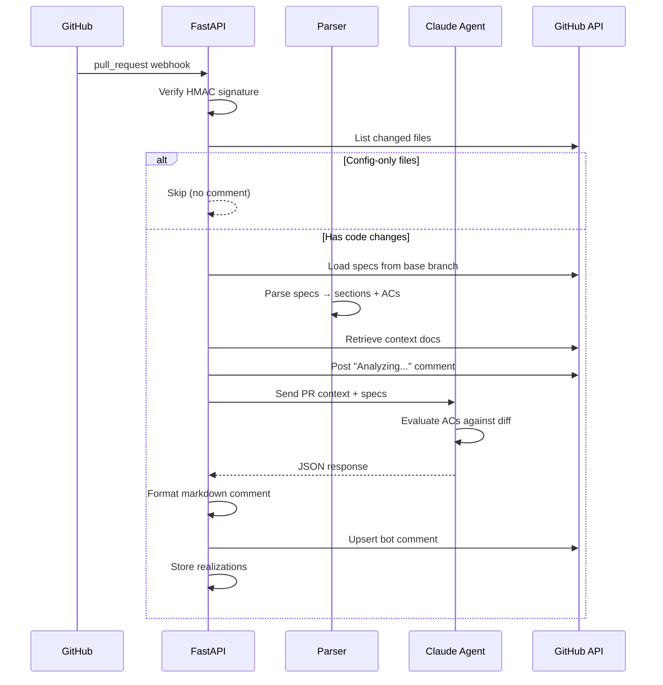
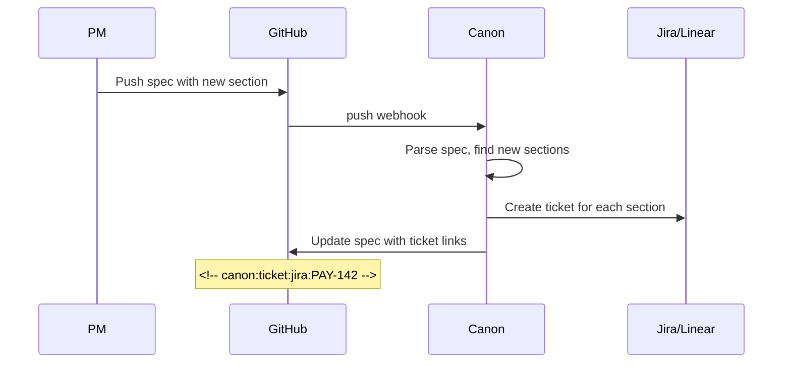
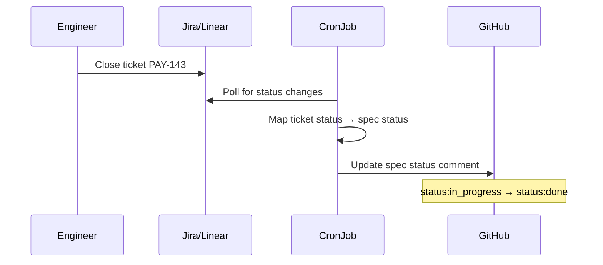
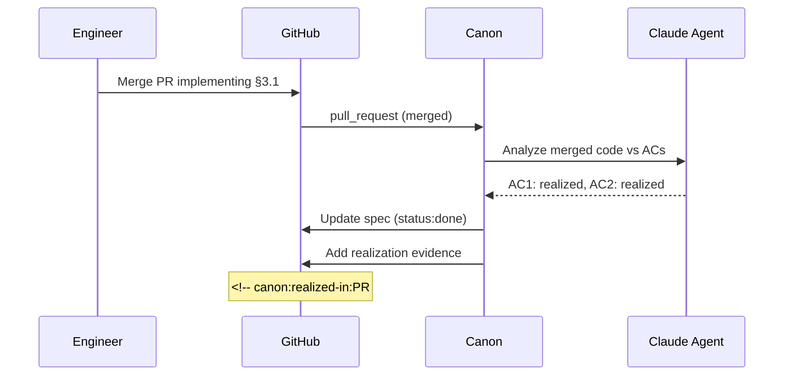
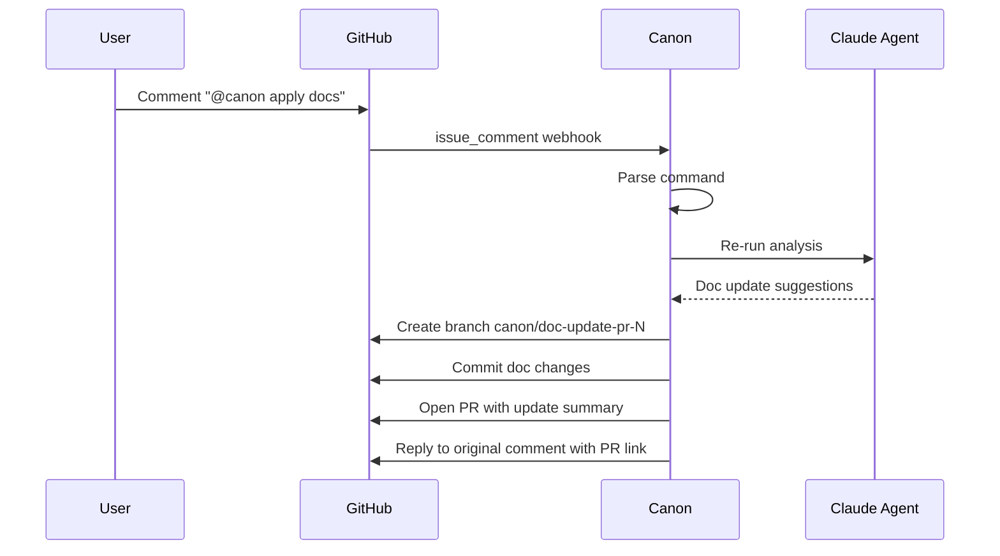
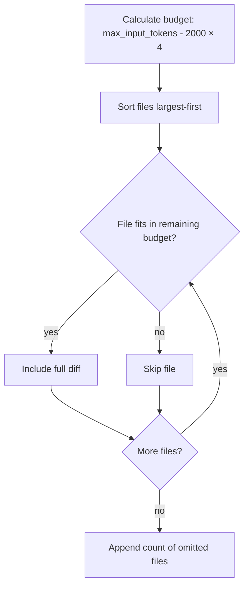

# Data Flow

Key workflows showing how data moves through the Canon system.

## PR Analysis Flow

The primary workflow — from webhook to PR comment:

## Ticket Sync Flow

### Forward Sync (Spec → Tickets)

### Reverse Sync (Tickets → Spec)

### Realization Sync (Code → Spec)

## Interactive Command Flow

When a user comments `@canon apply docs` on a PR:

## Diff Budgeting

The agent has a limited context window. Diffs are included using a budget-based approach:

With the default 128k input token limit, this yields ~504,000 characters for diffs. Files are sorted **largest-first** to prioritize the most substantial changes.
