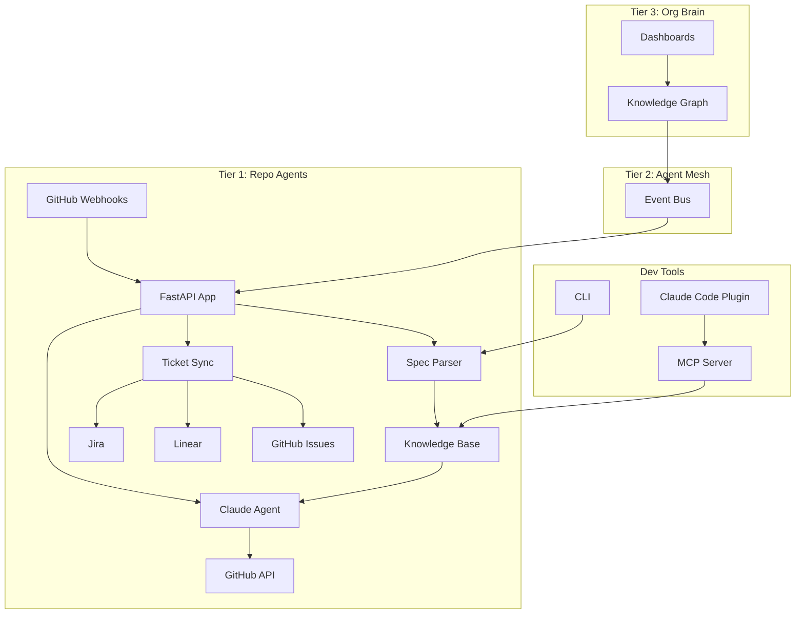

# Architecture

Canon's architecture is designed around three tiers — repo agents, agent mesh, and org brain — with a modular component structure.

## System Overview

## Component Map

| Component | Role | Key Files |
|-----------|------|-----------|
| [FastAPI App](./system-design#fastapi-app) | Webhook routes, health checks | `src/specwright/main.py` |
| [Spec Parser](./system-design#spec-parser) | Markdown parsing, frontmatter extraction | `src/specwright/parser/` |
| [Claude Agent](./system-design#agent-runtime) | PR analysis, realization checking | `src/specwright/agent/` |
| [Ticket Sync](./system-design#ticket-sync) | Bidirectional ticket synchronization | `src/specwright/sync/` |
| [GitHub Client](./system-design#github-client) | GitHub API, webhook verification | `src/specwright/github/` |
| [Config Parser](./system-design#config-parser) | CANON.yaml validation | `src/specwright/config/` |

## Further Reading

- [System Design](./system-design) — Detailed component breakdown
- [Data Flow](./data-flow) — Key workflow diagrams
- [Components](./components) — Per-module documentation
