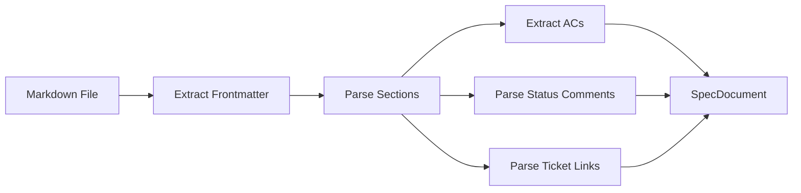

# System Design

Canon is a Python application built on FastAPI, with modular components for spec parsing, agent analysis, and ticket synchronization.

## Platform Components

```
┌──────────────┐  ┌──────────────┐  ┌─────────────┐
│  Doc Engine   │  │ Agent Runner │  │  Knowledge  │
│               │  │              │  │    Base     │
│ Parse all md  │  │ Claude calls │  │ Vector DB   │
│ Track specs   │  │ PR analysis  │  │ BM25 index  │
│ Diff & delta  │  │ Realization  │  │ Hybrid      │
│ Verify intent │  │ Doc gen      │  │ search      │
└───────────────┘  └──────────────┘  └─────────────┘
         │               │               │
    ┌────┴───┐     ┌─────┴────┐    ┌─────┴────┐
    │ Tickets│     │  Comms   │    │Dev Tools │
    │        │     │          │    │          │
    │ Jira   │     │ Slack    │    │ MCP      │
    │ Linear │     │ Teams    │    │ VS Code  │
    │ GitHub │     │ Email    │    │ Cursor   │
    └────────┘     └──────────┘    └──────────┘
```

## FastAPI App {#fastapi-app}

**File:** `src/specwright/main.py`

The main application exposes:
- `POST /webhook` — GitHub App webhook endpoint
- `GET /healthz` — Health check
- `POST /auth/device/code` + `/auth/device/token` — Device Authorization Grant for CLI login
- `POST /{org}/api/tickets/*` — Server-proxied ticket CRUD (used by CLI sync)
- Web routes for the SPA and fallback templates

All webhook events are verified using HMAC SHA-256 signature checking before being dispatched to handlers.

## Spec Parser {#spec-parser}

**Files:** `src/specwright/parser/`

The parser processes markdown spec files into structured Pydantic models:

- `parse.py` — Main parser (frontmatter extraction + section parsing + status comment parsing)
- `models.py` — Pydantic models: `SpecDocument`, `SpecSection`, `AcceptanceCriterion`
- `writer.py` — Writes back to spec files (insert ticket links, update status comments)

### Parse Flow



## Agent Runtime {#agent-runtime}

**Files:** `src/specwright/agent/`

The Claude agent runtime handles PR analysis:

- `client.py` — Anthropic SDK wrapper with model config and error types
- `analyzer.py` — Analysis orchestration, response parsing, comment formatting
- `prompts.py` — System prompt construction, user message builder, token estimation

### Model Configuration

Default values as of the current release — see `agent/client.py` for the latest:

| Parameter | Value |
|-----------|-------|
| Model | Claude Sonnet 4.5 |
| Max input tokens | 128,000 |
| Max output tokens | 16,000 |
| Temperature | 0 (deterministic) |

### Prompt Architecture

The system prompt is assembled from three pieces:

1. **Base system prompt** — Agent role, rules, severity levels
2. **Realization instructions** — AC evaluation criteria (when enabled)
3. **JSON schema** — Structured output enforcement

The user message includes PR metadata, spec summaries, context docs, changed file list, and diffs (budget-limited).

## GitHub Client {#github-client}

**Files:** `src/specwright/github/`

- `verify.py` — HMAC SHA-256 webhook signature verification
- `client.py` — GitHub API client (JWT auth via GitHub App, httpx)
- `spec_utils.py` — Spec file detection and loading from GitHub
- `handlers/` — Event handlers for push, PR, issue_comment, etc.

## Ticket Sync {#ticket-sync}

**Files:** `src/specwright/sync/`

Bidirectional synchronization between spec sections and external ticket systems:

- `engine.py` — Forward/reverse sync logic
- `status_map.py` — Bidirectional spec-to-ticket status mapping
- `models.py` — Pydantic models for sync operations
- `adapters/` — Per-system adapters (Jira, Linear, GitHub Issues, API Proxy)

### Server-Proxied Sync

**Files:** `src/specwright/sync/adapters/api_proxy.py`, `src/specwright/web/ticket_routes.py`

When CLI users are logged in (`canon login`), the sync engine uses the `CanonApiAdapter` instead of calling GitHub directly. This adapter routes ticket CRUD through the Canon server's `/api/tickets/*` endpoints, which use the GitHub App installation token. The server endpoints are in `web/ticket_routes.py`.

### Adapter Interface

```python
class TicketAdapter:
    async def create_ticket(self, input: CreateTicketInput) -> CreateTicketResult
    async def update_ticket(self, id: str, changes: dict) -> None
    async def sync_status(self, id: str) -> str
    async def link_pr(self, ticket_id: str, pr_url: str) -> None
    async def close_ticket(self, id: str, evidence: str) -> None
```

## Config Parser {#config-parser}

**Files:** `src/specwright/config/`

- `parse.py` — YAML parsing into Pydantic models with validation

Validates `CANON.yaml` files and provides typed access to all configuration values. Unknown keys produce warnings rather than errors for forward compatibility.

## Cron Jobs

**Files:** `src/specwright/cron/`

- `sync_status.py` — Standalone reverse sync script run as a Kubernetes CronJob

Periodically polls ticket systems for status changes and updates spec files accordingly.
