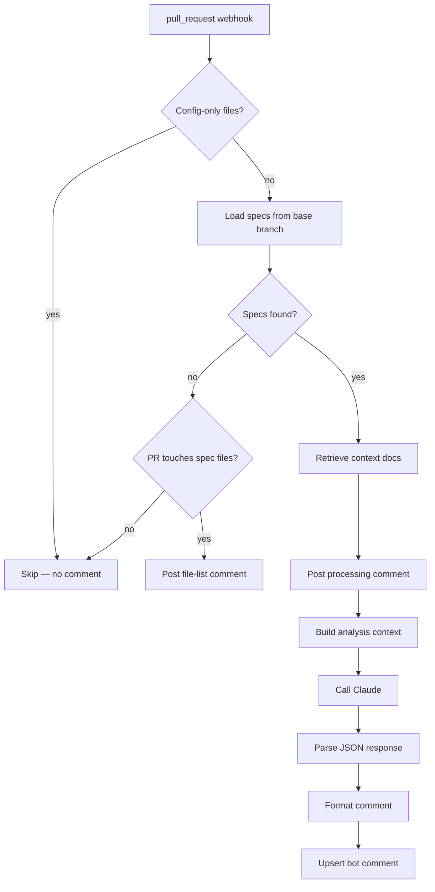

# Agent Mesh

Canon's architecture is built in three tiers, from single-repo agents up to an organization-wide knowledge brain.

## Three-Tier Architecture

```
┌─────────────────────────────────────────────────┐
│              ORG BRAIN (Tier 3)                  │
│                                                  │
│  Knowledge graph · Cross-repo search · Patterns  │
│  "Who owns payments?" · "What decided X?"        │
│  Org-wide spec coverage · Dependency map          │
│  Executive dashboards · Compliance reports        │
├─────────────────────────────────────────────────┤
│              AGENT MESH (Tier 2)                 │
│                                                  │
│  Agent-to-agent communication · Event bus         │
│  "Repo A's spec references Repo B's API"         │
│  Cross-team impact analysis · Conflict detection  │
│  Shared vocabulary / taxonomy enforcement         │
├─────────────────────────────────────────────────┤
│              REPO AGENTS (Tier 1)                │
│                                                  │
│  All-markdown indexing · PR analysis · Doc PRs    │
│  Spec realization · Ticket sync · Stale detection │
│  MCP server · Slack Q&A · Coverage metrics        │
│  ┌──────┐ ┌──────┐ ┌──────┐ ┌──────┐           │
│  │Repo 1│ │Repo 2│ │Repo 3│ │ ×300 │           │
│  └──────┘ └──────┘ └──────┘ └──────┘           │
└─────────────────────────────────────────────────┘
```

**Tier 1** is where you start. **Tier 2** is the moat. **Tier 3** is the platform.

## Tier 1: Repo Agents

Each repository gets its own agent that handles:

- **All-markdown indexing** — Parses specs, ADRs, guides, READMEs into a searchable knowledge base
- **PR analysis** — Analyzes pull requests against spec acceptance criteria and indexed docs
- **Spec realization** — Verifies code implements what specs say, with evidence
- **Doc-update PRs** — Generates pull requests to update stale documentation
- **Ticket sync** — Bidirectional link between spec sections and Jira/Linear/GitHub Issues
- **Stale detection** — Flags docs that haven't been updated when related code changes
- **MCP server** — Exposes spec knowledge to coding agents (Claude Code, Cursor, VS Code)

### Analysis Pipeline

The PR analysis pipeline is the core workflow:



### Interactive Commands

Users interact with the bot by commenting on PRs:

| Command | Behavior |
|---------|----------|
| `@canon dismiss` | Deletes the bot's analysis comment |
| `@canon reanalyze` | Re-runs the full analysis pipeline |
| `@canon apply docs` | Creates a PR with suggested doc updates applied |

## Tier 2: Agent Mesh

::: info Status: Planned
Tier 2 is on the roadmap. The features below describe the design vision.
:::

When multiple repos have agents, the mesh layer enables cross-repo awareness:

- **Cross-repo references** — Repo A's spec references Repo B's API; changes to B trigger analysis in A
- **Impact analysis** — A breaking change in a shared library flags all downstream specs
- **Conflict detection** — Two teams' specs make contradictory assumptions about the same system
- **Shared taxonomy** — Enforce consistent terminology and patterns across the organization

## Tier 3: Org Brain

::: info Status: Planned
Tier 3 is on the roadmap. The features below describe the design vision.
:::

The org brain aggregates knowledge from all repo agents:

- **Cross-repo search** — "What does our retry policy look like across all services?"
- **Ownership graph** — "Who owns the payments domain?"
- **Decision index** — "What ADRs relate to database choices?"
- **Compliance reports** — "Which specs lack acceptance criteria?"
- **Executive dashboards** — Organization-wide spec coverage and documentation health

## The Network Effect

```
1 repo   → nice spec workflow, all docs searchable
10 repos → cross-repo references, shared knowledge base
50 repos → the agent mesh becomes indispensable
300 repos → the org brain knows more than any human
            about how the company's software works
```

Each new repo makes every existing repo's agent smarter. Each indexed doc enriches the knowledge base. Each PR analysis teaches the platform what changed.

## Related

- **Guide**: [Self-Hosting](/guides/self-hosting) — deploy Canon on your own K8s cluster
- **Guide**: [CI Integration](/guides/ci-integration) — run `canon verify` in your CI pipeline
- **Reference**: [MCP Tools](/reference/mcp) — the 11 tools exposed to coding agents
- **Reference**: [Claude Code Skills](/reference/skills) — `/canon-*` commands for interactive agent workflows
- **Architecture**: [System Design](/architecture/system-design) — component diagram and deployment architecture
- **Architecture**: [Data Flow](/architecture/data-flow) — PR analysis and ticket sync request flows
